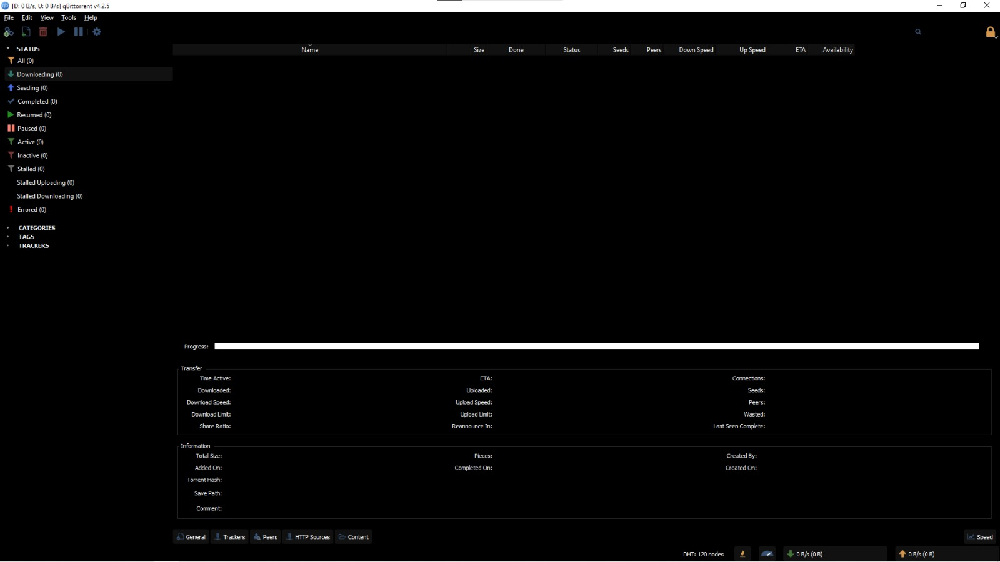

# qBittorrent / Black

A fully dark theme for qBittorrent; just simple black and white, nothing else.

## Preview

## Prerequisites

- Python

## Setup

1. Run `./build.bat` to generate the `black.qbtheme`.

2. In `qBittorrent`, open up `Options` _(`ALT`+`O`)_ and check `Use custom UI Theme` and point towards the path of the generated `black.qbtheme` file.

## Making your own

If you wish to make your own theme using this as base, look through `styles.qss`, it contains all the style changes.

Also, refer to [this](https://doc.qt.io/qt-5/stylesheet-reference.html) if you wish.
