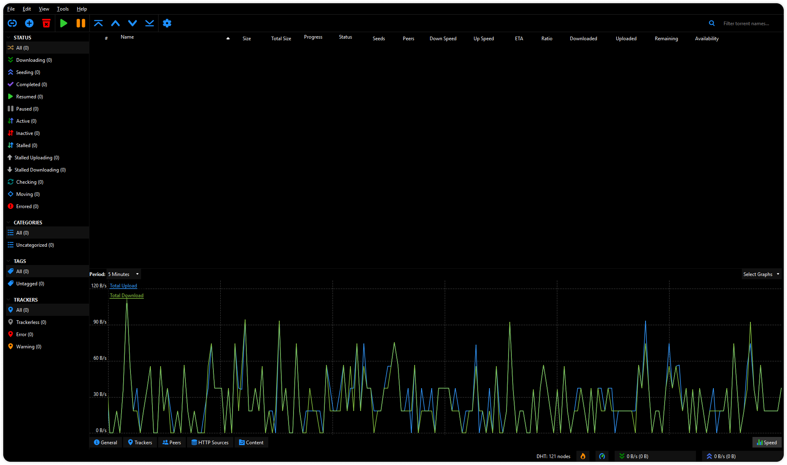

# qBittorrent Client / Black Theme

A fully dark theme for qBittorrent client, just simple black and white, nothing else.

## Preview

## Download

<a href="./black.qbtheme" download>qBittorrent Black Theme (.qbtheme)</a>

_This theme was made for qBittorrent v4.3.4.1_

Open up `Options` _(`ALT`+`O`)_ and check `Use custom UI Theme` and select the `black.qbtheme` file.

## Make your own

### Prerequisites

- Python

### Generating a `.qbtheme` file

1. Run `./build.bat` to generate the `black.qbtheme` file.

Look through `styles.qss`, it contains all the style changes and refer to [QT Stylesheet Reference](https://doc.qt.io/qt-5/stylesheet-reference.html) if you wish.
